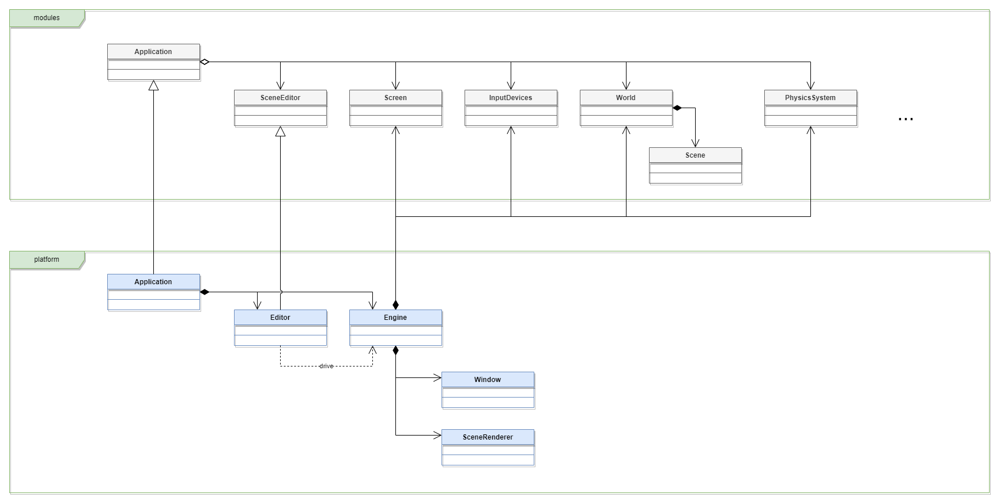

# nodec_game_engine

[English](./README.md) | 日本語

`nodec_game_engine`は、`nodec`フレームワークで作られたゲームエンジンです。

## 対応環境

* Windows

> ℹ️ **NOTE: ほかのプラットフォームには対応する?**
>
> 以下のプラットフォームに対応することを目指しています。
>
> * macOS
> * Android

## アーキテクチャ

## テンプレートプロジェクト

本エンジンを使ってアプリを作りたい場合は、以下のテンプレートプロジェクトを使用してください。

<https://github.com/ContentsViewer/hello-nodec-game>
