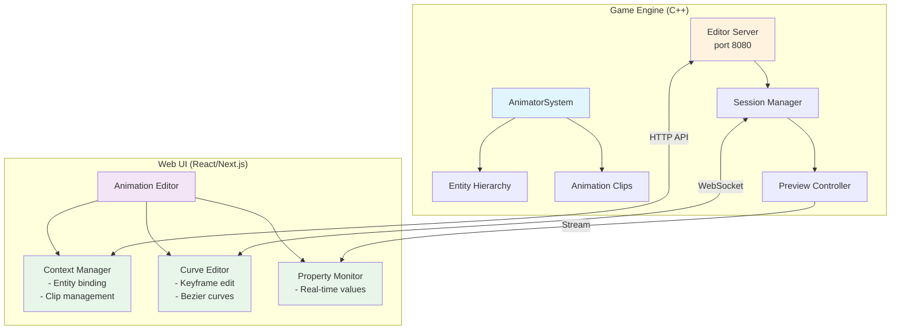
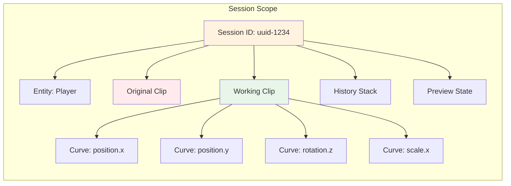
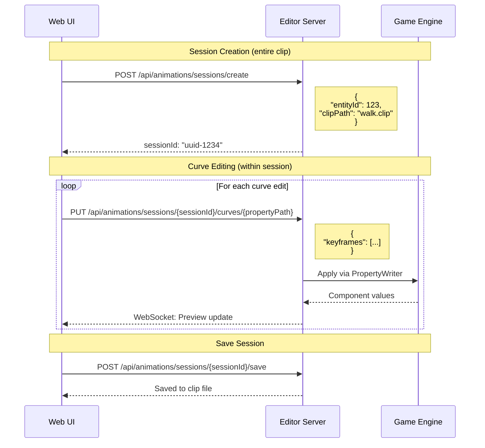
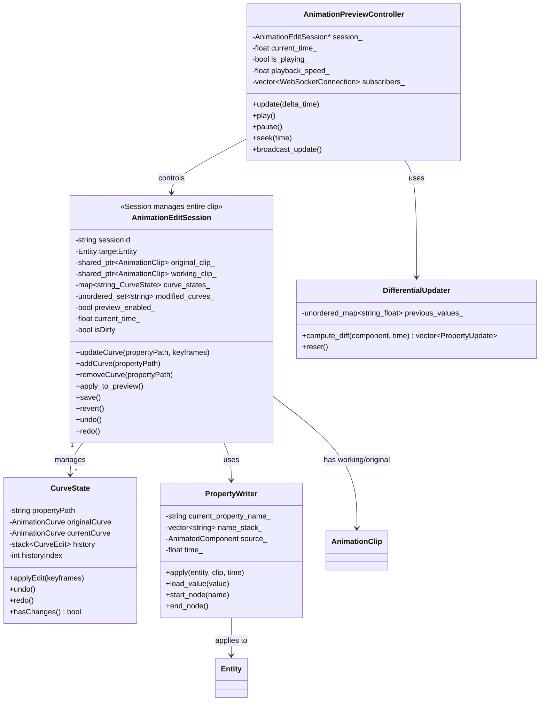
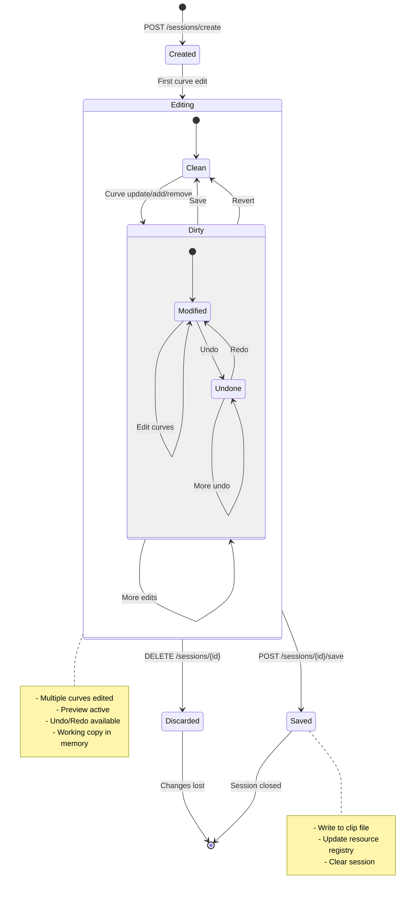
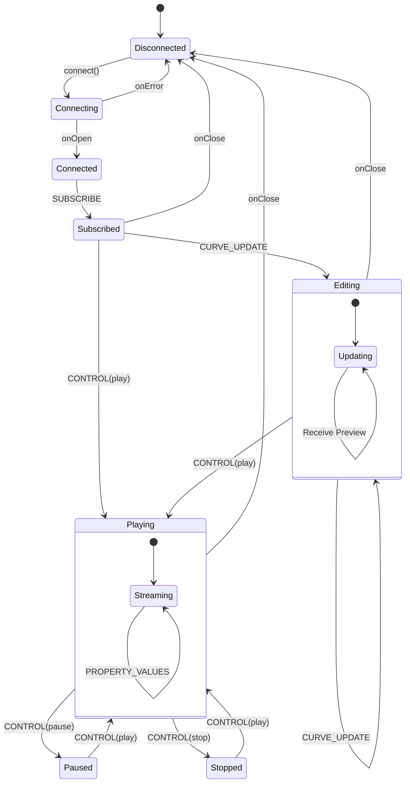
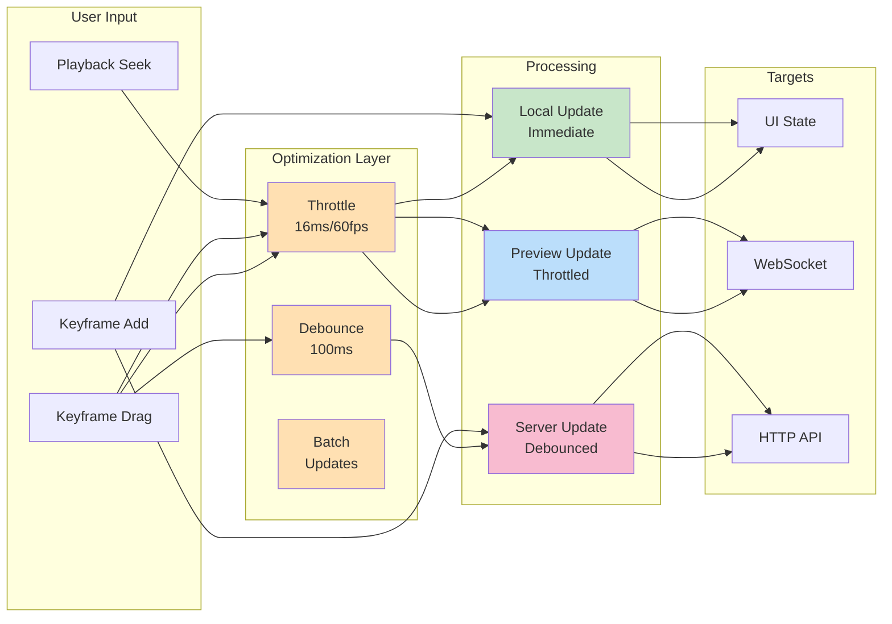
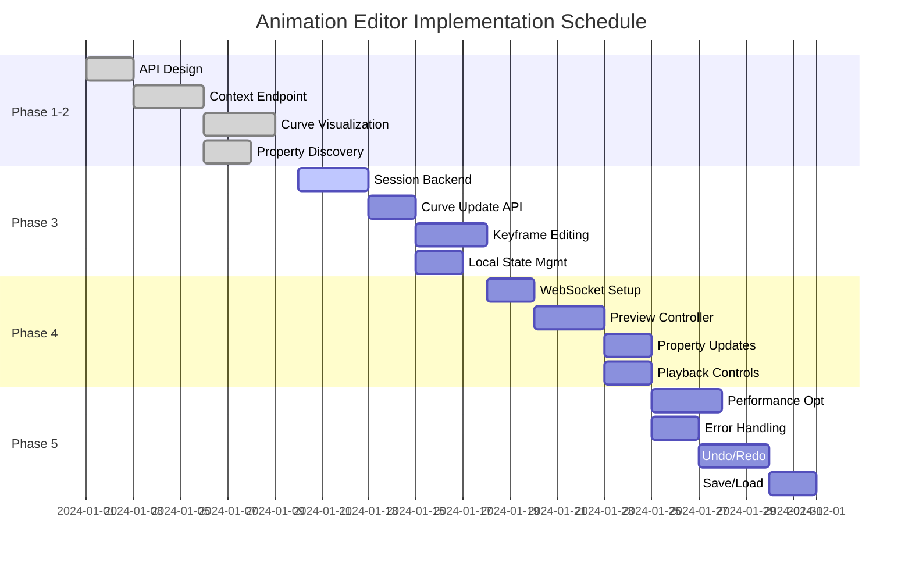

# Animation Web Editor Implementation Plan

## Overview
Implement a web-based animation editor that leverages web ecosystem UI components for rich curve editing capabilities, integrated with the existing Editor Server architecture. The editor must handle the relationship between AnimationClips, Animator components, and entity hierarchies with real-time preview in the game engine.

## Architecture Overview



## Current Implementation Status

### ✅ Completed (Phase 1-2)
1. **Animation Editing Context API**
   - `GET /api/animations/editing-context?entityId=<id>` - Returns curves, properties, and clip data
   - Helper functions for curve extraction and property traversal
   - Full keyframe data serialization

2. **Web UI Curve Visualization**
   - CurveViewer component with canvas rendering
   - Multi-curve display with selection
   - Timeline and playback controls (UI only)
   - Property list display

### 🚧 In Progress (Phase 3-4)
3. **Curve Editing** - Interactive keyframe manipulation
4. **Real-time Preview** - Engine preview integration

## Phase 3: Interactive Curve Editing with Preview Integration

### Objective
Enable curve editing in Web UI with immediate preview in the game engine using session-based management.

### Session Concept

A **session** represents a complete editing context for an entire AnimationClip, NOT individual curves:

- **One Session = One AnimationClip**: Each session manages all curves within a single clip
- **Working Copy**: Maintains a separate copy of the clip for editing without affecting the original
- **Transaction Boundary**: All changes within a session can be saved or discarded as a unit
- **Preview Context**: The session maintains preview state for all curves simultaneously
- **History Management**: Undo/Redo operations tracked at the session level



### Architecture: Edit-Preview Flow



### Implementation Tasks

#### 3.1 Session Management (C++)



```cpp
class AnimationEditSession {
private:
    // Original and working copies
    std::shared_ptr<AnimationClip> original_clip_;
    std::shared_ptr<AnimationClip> working_clip_;
    
    // Change tracking
    std::unordered_set<std::string> modified_curves_;
    
    // Preview state
    bool preview_enabled_ = true;
    float current_time_ = 0.0f;
    
public:
    void update_curve(const std::string& property_path, 
                     const std::vector<Keyframe>& keyframes) {
        // Update working copy
        auto* curve = find_curve_by_path(working_clip_, property_path);
        if (curve) {
            curve->set_keyframes(keyframes);
            modified_curves_.insert(property_path);
            
            // Auto-apply to preview
            if (preview_enabled_) {
                apply_to_preview();
            }
        }
    }
    
    void apply_to_preview() {
        // Use PropertyWriter to apply animation
        AnimatedComponentWriter writer;
        writer.apply(entity_, working_clip_->root_entity(), current_time_);
    }
};
```

#### 3.2 Session-Based Curve Editor (React)
```tsx
interface AnimationEditorProps {
  entityId: number;
  clipPath?: string;
}

const AnimationEditor: React.FC<AnimationEditorProps> = ({ entityId, clipPath }) => {
  const [sessionId, setSessionId] = useState<string | null>(null);
  const [sessionData, setSessionData] = useState<SessionData | null>(null);
  const [selectedCurves, setSelectedCurves] = useState<Set<string>>(new Set());
  
  // Create session on mount
  useEffect(() => {
    const createSession = async () => {
      const response = await api.createAnimationSession({
        entityId,
        clipPath
      });
      setSessionId(response.sessionId);
      setSessionData(response);
    };
    createSession();
    
    // Cleanup on unmount
    return () => {
      if (sessionId) {
        api.deleteSession(sessionId);
      }
    };
  }, [entityId, clipPath]);
  
  // Update curve within session
  const handleCurveUpdate = useCallback(
    debounce(async (propertyPath: string, keyframes: Keyframe[]) => {
      if (!sessionId) return;
      
      await api.updateSessionCurve(
        sessionId,
        propertyPath,
        { keyframes }
      );
    }, 100),
    [sessionId]
  );
  
  // Add new curve to session
  const handleAddCurve = async (propertyPath: string) => {
    if (!sessionId) return;
    
    await api.addSessionCurve(sessionId, {
      propertyPath,
      keyframes: [
        { time: 0, value: 0 },
        { time: 1, value: 1 }
      ]
    });
    
    // Refresh session data
    const updated = await api.getSession(sessionId);
    setSessionData(updated);
  };
  
  // Save entire session
  const handleSave = async () => {
    if (!sessionId) return;
    
    await api.saveSession(sessionId);
    toast.success('Animation saved successfully');
  };
  
  // Undo/Redo
  const handleUndo = () => api.undoSession(sessionId);
  const handleRedo = () => api.redoSession(sessionId);
  
  return (
    <Box>
      <Toolbar>
        <Button onClick={handleSave}>Save</Button>
        <Button onClick={handleUndo}>Undo</Button>
        <Button onClick={handleRedo}>Redo</Button>
        <Chip label={sessionData?.isDirty ? 'Modified' : 'Saved'} />
      </Toolbar>
      
      <PropertyTree
        properties={sessionData?.availableProperties}
        onAddCurve={handleAddCurve}
      />
      
      {sessionData?.curves.map(curve => (
        <CurveEditor
          key={curve.propertyPath}
          curve={curve}
          onUpdate={(keyframes) => 
            handleCurveUpdate(curve.propertyPath, keyframes)
          }
        />
      ))}
    </Box>
  );
};
```

#### 3.3 Performance Optimization

##### Differential Updates
```cpp
class DifferentialUpdater {
    std::unordered_map<std::string, float> previous_values_;
    
public:
    std::vector<PropertyUpdate> compute_diff(
        const AnimatedComponent& component,
        float time) {
        
        std::vector<PropertyUpdate> updates;
        
        for (const auto& [path, prop] : component.properties) {
            float new_value = prop.curve.evaluate(time).second;
            float old_value = previous_values_[path];
            
            if (std::abs(new_value - old_value) > 0.0001f) {
                updates.push_back({path, old_value, new_value});
                previous_values_[path] = new_value;
            }
        }
        
        return updates;
    }
};
```

##### Debouncing Strategy
```typescript
// UI-side optimization
const EditOptimizer = {
  // Immediate local update for responsiveness
  updateLocal: (curve: AnimationCurve) => {
    setLocalState(curve);
  },
  
  // Throttled preview updates (60fps)
  updatePreview: throttle((curve: AnimationCurve) => {
    ws.send({ type: 'PREVIEW_UPDATE', curve });
  }, 16),
  
  // Debounced save (100ms after last edit)
  updateServer: debounce((curve: AnimationCurve) => {
    api.saveSessionCurve(sessionId, curve);
  }, 100)
};
```

### API Endpoints

#### Session Management

```typescript
// 1. Create session for entire clip
POST /api/animations/sessions/create
Request: {
  entityId: number;           // Target entity with Animator
  clipPath?: string;          // Existing clip or create new
}
Response: {
  sessionId: string;
  clipData: {
    duration: number;
    curves: AnimationCurve[];
  };
  entityHierarchy: EntityNode[];
  availableProperties: PropertyInfo[];
}

// 2. Update curve within session
PUT /api/animations/sessions/:sessionId/curves/:encodedPropertyPath
Request: {
  keyframes: Keyframe[];
  wrapMode?: WrapMode;
}
Response: {
  success: boolean;
  preview?: PropertyValues;   // Current values at time
}

// 3. Add new curve to session
POST /api/animations/sessions/:sessionId/curves
Request: {
  propertyPath: string;
  keyframes: Keyframe[];
  componentType?: string;     // For type validation
}

// 4. Remove curve from session
DELETE /api/animations/sessions/:sessionId/curves/:encodedPropertyPath

// 5. Save session to clip file
POST /api/animations/sessions/:sessionId/save
Request: {
  clipPath?: string;          // Save as new file
  overwrite?: boolean;
}

// 6. Discard session
DELETE /api/animations/sessions/:sessionId

// 7. Undo/Redo operations
POST /api/animations/sessions/:sessionId/undo
POST /api/animations/sessions/:sessionId/redo
```

### Session Lifecycle



## Phase 4: Real-time Preview Integration

### Objective
Preview animations on actual entities while editing with WebSocket streaming.

### Implementation Approach

#### 4.1 Preview Controller (C++)
```cpp
class AnimationPreviewController {
private:
    AnimationEditSession* session_;
    float current_time_ = 0.0f;
    bool is_playing_ = false;
    float playback_speed_ = 1.0f;
    
    // WebSocket connections
    std::vector<WebSocketConnection*> subscribers_;
    
public:
    void update(float delta_time) {
        if (is_playing_) {
            current_time_ += delta_time * playback_speed_;
            
            // Wrap or clamp time
            if (current_time_ > session_->duration()) {
                current_time_ = 0.0f; // Loop
            }
            
            apply_animation();
            broadcast_update();
        }
    }
    
    void apply_animation() {
        // Apply working clip at current time
        session_->apply_to_preview(current_time_);
        
        // Collect property values
        auto values = collect_animated_values(session_->entity);
        
        // Send to subscribers
        broadcast_property_values(values);
    }
    
    void broadcast_update() {
        json update = {
            {"type", "TIME_UPDATE"},
            {"time", current_time_},
            {"isPlaying", is_playing_}
        };
        
        for (auto* ws : subscribers_) {
            ws->send(update.dump());
        }
    }
};
```

#### 4.2 WebSocket Protocol
```typescript
// Client-side WebSocket handler
class AnimationPreviewSocket {
  private ws: WebSocket;
  private sessionId: string;
  
  connect(sessionId: string) {
    this.ws = new WebSocket('ws://localhost:8080/api/animations/preview-stream');
    this.sessionId = sessionId;
    
    this.ws.onopen = () => {
      this.ws.send(JSON.stringify({
        type: 'SUBSCRIBE',
        sessionId
      }));
    };
  }
  
  sendControl(action: 'play' | 'pause' | 'stop' | 'seek', params?: any) {
    this.ws.send(JSON.stringify({
      type: 'CONTROL',
      action,
      sessionId: this.sessionId,
      ...params
    }));
  }
  
  onMessage(handler: (msg: PreviewMessage) => void) {
    this.ws.onmessage = (event) => {
      const data = JSON.parse(event.data);
      handler(data);
    };
  }
}
```

#### 4.3 Preview UI Integration
```tsx
const PreviewController: React.FC<{
  sessionId: string;
  duration: number;
  onTimeChange: (time: number) => void;
}> = ({ sessionId, duration, onTimeChange }) => {
  const [state, setState] = useState({
    isPlaying: false,
    currentTime: 0,
    speed: 1.0
  });
  
  const ws = useRef<AnimationPreviewSocket>();
  
  useEffect(() => {
    ws.current = new AnimationPreviewSocket();
    ws.current.connect(sessionId);
    
    ws.current.onMessage((msg) => {
      if (msg.type === 'TIME_UPDATE') {
        setState(s => ({ ...s, currentTime: msg.time }));
        onTimeChange(msg.time);
      } else if (msg.type === 'PROPERTY_VALUES') {
        updatePropertyMonitor(msg.properties);
      }
    });
    
    return () => ws.current?.disconnect();
  }, [sessionId]);
  
  const handlePlay = () => {
    ws.current?.sendControl('play');
    setState(s => ({ ...s, isPlaying: true }));
  };
  
  const handleSeek = (time: number) => {
    ws.current?.sendControl('seek', { time });
    setState(s => ({ ...s, currentTime: time }));
  };
  
  return (
    <Box sx={{ display: 'flex', alignItems: 'center', gap: 1 }}>
      <IconButton onClick={handlePlay}>
        {state.isPlaying ? <Pause /> : <PlayArrow />}
      </IconButton>
      
      <Slider
        value={state.currentTime}
        max={duration}
        onChange={(_, value) => handleSeek(value as number)}
      />
      
      <Typography variant="caption">
        {state.currentTime.toFixed(2)}s / {duration.toFixed(2)}s
      </Typography>
      
      <SpeedControl
        value={state.speed}
        onChange={(speed) => {
          ws.current?.sendControl('speed', { speed });
          setState(s => ({ ...s, speed }));
        }}
      />
    </Box>
  );
};
```

### WebSocket Message Types



#### Client → Server
```typescript
interface ClientMessage {
  type: 'SUBSCRIBE' | 'UNSUBSCRIBE' | 'CONTROL' | 'CURVE_UPDATE';
  sessionId: string;
  // Control specific
  action?: 'play' | 'pause' | 'stop' | 'seek' | 'speed';
  time?: number;
  speed?: number;
  // Curve update specific
  propertyPath?: string;
  keyframes?: Keyframe[];
}
```

#### Server → Client
```typescript
interface ServerMessage {
  type: 'TIME_UPDATE' | 'PROPERTY_VALUES' | 'STATE_CHANGE' | 'ERROR';
  // Time update
  time?: number;
  isPlaying?: boolean;
  // Property values
  properties?: Record<string, number>;
  // State change
  state?: 'playing' | 'paused' | 'stopped';
  // Error
  error?: string;
}
```

## Phase 5: Advanced Features

### 5.1 Multi-Property Editing
- Select multiple properties
- Batch operations (scale, offset)
- Copy/paste curves between properties

### 5.2 Curve Templates
- Save curve presets
- Apply easing functions
- Import/export curve data

### 5.3 Animation Blending
- Preview transitions between clips
- Blend weight adjustment
- Cross-fade visualization

### 5.4 Validation and Constraints
```cpp
class PropertyConstraints {
    struct Constraint {
        float min_value;
        float max_value;
        bool is_cyclic;  // For angles
        std::string unit; // "degrees", "meters", etc.
    };
    
    std::unordered_map<std::string, Constraint> constraints_;
    
public:
    ValidationResult validate_curve(
        const std::string& property_path,
        const AnimationCurve& curve) {
        
        auto it = constraints_.find(property_path);
        if (it == constraints_.end()) {
            return ValidationResult::OK; // No constraints
        }
        
        const auto& constraint = it->second;
        
        for (const auto& keyframe : curve.keyframes()) {
            if (keyframe.value < constraint.min_value ||
                keyframe.value > constraint.max_value) {
                return ValidationResult::OUT_OF_RANGE;
            }
        }
        
        return ValidationResult::OK;
    }
};
```

## Technology Recommendations

### Core Libraries

#### Animation & Curves
1. **Custom Canvas Implementation** (Current)
   - Full control over rendering and interaction
   - Good performance
   - Already implemented in CurveViewer

2. **D3.js Integration** (Future Enhancement)
   - For advanced curve manipulation
   - Better interaction handling
   - Rich animation capabilities

#### State Management
```typescript
// Zustand store for animation editor state
interface AnimationEditorStore {
  // Context
  context: AnimationContext | null;
  sessionId: string | null;
  
  // Playback state
  currentTime: number;
  isPlaying: boolean;
  playbackSpeed: number;
  
  // Selection
  selectedCurves: Set<string>;
  selectedKeyframes: Map<string, number[]>;
  
  // Actions
  loadEntity: (entityId: number) => Promise<void>;
  createSession: () => Promise<void>;
  updateCurve: (path: string, curve: AnimationCurve) => void;
  setCurrentTime: (time: number) => void;
  play: () => void;
  pause: () => void;
  
  // Undo/Redo
  history: CurveHistory[];
  historyIndex: number;
  undo: () => void;
  redo: () => void;
}
```

## Error Handling Strategy

### Client-Side Validation
```typescript
const validateKeyframe = (keyframe: Keyframe, constraints: PropertyConstraints): ValidationResult => {
  if (keyframe.time < 0) {
    return { valid: false, error: 'Time cannot be negative' };
  }
  
  if (constraints) {
    if (keyframe.value < constraints.min || keyframe.value > constraints.max) {
      return { 
        valid: false, 
        error: `Value must be between ${constraints.min} and ${constraints.max}` 
      };
    }
  }
  
  return { valid: true };
};
```

### Server-Side Recovery
```cpp
class SessionRecovery {
    void handle_websocket_disconnect(const std::string& session_id) {
        // Keep session alive for reconnection
        auto* session = get_session(session_id);
        if (session) {
            session->mark_disconnected();
            
            // Start grace period timer
            schedule_cleanup(session_id, std::chrono::minutes(5));
        }
    }
    
    void handle_reconnect(const std::string& session_id, WebSocket* ws) {
        auto* session = get_session(session_id);
        if (session && !session->is_expired()) {
            session->reconnect(ws);
            
            // Send full state update
            send_full_state(ws, session);
        }
    }
};
```

## Performance Metrics

### Target Performance
- **Curve Update Latency**: < 16ms (60fps)
- **Preview Update Rate**: 30-60fps
- **WebSocket Latency**: < 10ms local, < 50ms network
- **Session Memory**: < 10MB per session
- **Maximum Concurrent Sessions**: 10

### Optimization Strategies



1. **Batching**: Group multiple updates in single frame
2. **Throttling**: Limit update frequency during rapid edits (60fps for preview)
3. **Debouncing**: Delay server saves until editing stops (100ms)
4. **Caching**: Cache evaluated curve values
5. **LOD**: Reduce update frequency for non-visible properties
6. **Compression**: Compress WebSocket messages for network

## Implementation Timeline



### Week 1: Session Foundation ✅
- [x] Design API endpoints
- [x] Implement editing context endpoint
- [x] Create curve visualization
- [x] Basic property discovery

### Week 2: Curve Editing (Current)
- [ ] Session management backend
- [ ] Curve update API
- [ ] Interactive keyframe editing
- [ ] Local state management

### Week 3: Preview Integration
- [ ] WebSocket setup
- [ ] Preview controller
- [ ] Real-time property updates
- [ ] Playback controls

### Week 4: Polish & Optimization
- [ ] Performance optimization
- [ ] Error handling
- [ ] Undo/redo support
- [ ] Save/load functionality

## Success Metrics

### Phase 3 (Curve Editing)
- [ ] Can drag keyframes to new positions
- [ ] Changes persist through session
- [ ] Smooth interaction at 60fps
- [ ] Validation prevents invalid values

### Phase 4 (Preview)
- [ ] Real-time preview while editing
- [ ] < 50ms latency for local preview
- [ ] Smooth playback at 30fps minimum
- [ ] WebSocket connection stable over time

### Phase 5 (Advanced)
- [ ] Multi-property batch editing
- [ ] Template system functional
- [ ] Blending preview accurate

## Risk Mitigation

### Performance Degradation
- **Risk**: Too many curves slow down editor
- **Mitigation**: Virtual scrolling, LOD system, progressive loading

### Session State Loss
- **Risk**: Browser crash loses unsaved work
- **Mitigation**: Auto-save to localStorage, server-side session persistence

### Network Instability
- **Risk**: WebSocket disconnections interrupt preview
- **Mitigation**: Reconnection logic, offline mode, state synchronization

### Browser Compatibility
- **Risk**: Canvas features not supported in all browsers
- **Mitigation**: Feature detection, WebGL fallback, progressive enhancement

## Future Enhancements

1. **Collaborative Editing**: Multiple users editing same animation
2. **Version Control**: Git-friendly animation format with diff support
3. **AI-Assisted Animation**: Automatic in-betweening and motion prediction
4. **Performance Capture**: Import motion capture data
5. **Procedural Animation**: Node-based curve generation
6. **Mobile Support**: Touch-based curve editing